# Three.js Rendering Escape Room 최종 리포트

## 0. 게임 개요

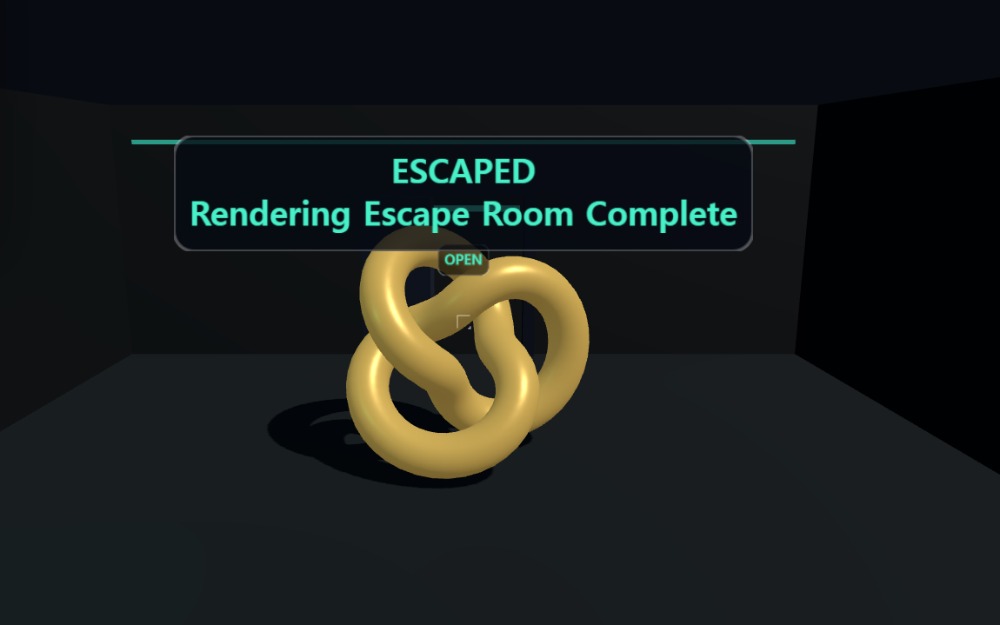

본 프로젝트는 Computer Graphics 강의에서 다룬 주요 렌더링 개념을 여섯 개의 방탈출 퍼즐로 재구성한 Three.js 웹 게임입니다. 플레이어는 1인칭 시점으로 방을 이동하며 조명, 셰이딩, 텍스처, 계층 애니메이션, DDGI, Surfel GI를 순서대로 해결합니다.

전체 진행은 단순히 설명을 읽고 넘어가는 방식이 아니라, 각 개념을 직접 조작하면서 확인하도록 구성했습니다. 조명 방에서는 하이라이트가 가장 강하게 나타나는 표면점을 찾아야 하고, 셰이딩 방에서는 Flat, Gouraud, Phong 셰이딩의 차이를 눈으로 구분해야 합니다. 텍스처 방에서는 wrapping과 UV transform 값을 조절해 목표 텍스처와 맞춰야 하며, 애니메이션 방에서는 로봇팔의 관절 계층을 이용해 인형을 옮겨야 합니다. 마지막 두 방에서는 DDGI probe와 Surfel GI cache를 직접 배치해야 숨은 적을 볼 수 있습니다.

구현은 Vite 기반 Three.js로 진행했습니다. 주요 코드는 `src/main.js`에 작성했으며, 방 전환, 렌더링, 조작, 충돌, UI, GI 계산을 하나의 흐름으로 관리했습니다. 렌더러는 `THREE.WebGLRenderer`를 사용했고, 시각적 완성도를 높이기 위해 shadow map, SSAO, bloom, tone mapping을 함께 적용했습니다. 각 방은 `THREE.Group`으로 묶어 관리했으며, 방을 이동할 때 이전 방의 geometry, material, texture를 정리하도록 구성했습니다.

진행 순서는 다음과 같습니다.

```text
Lighting Room -> Shading Room -> Texture Room -> Animation Room -> DDGI Hide and Seek -> Surfel GI Hide and Seek
```

각 방은 강의 내용과 직접 연결됩니다. 1번 방은 Phong 조명과 벡터 연산, 2번 방은 Flat/Gouraud/Phong 셰이딩, 3번 방은 UV와 텍스처 좌표, 4번 방은 joint hierarchy와 forward kinematics, 5번 방은 DDGI probe, 6번 방은 Surfel GI cache를 중심으로 구성했습니다.

## 1. 조명 방

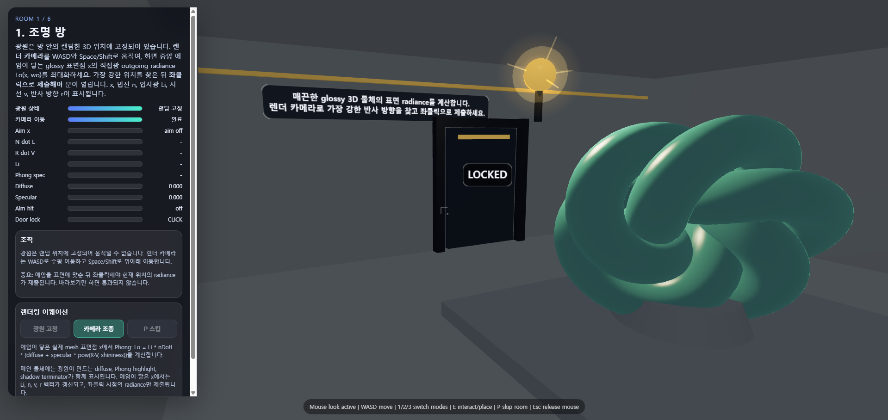

첫 번째 단계는 Phong 조명 모델을 이용한 조명 퍼즐입니다. 방 안에는 노란 광원과 초록색 glossy 물체가 배치되어 있습니다. 물체는 단순한 구가 아니라 `TorusKnotGeometry`로 만든 꼬인 형태의 3D 물체입니다. 표면 방향이 계속 달라지는 형태이기 때문에, 플레이어가 어느 위치에서 어떤 지점을 바라보느냐에 따라 밝기와 하이라이트가 크게 달라집니다.

목표는 가장 강한 Phong 반사가 나타나는 표면점을 찾는 것입니다. 광원은 랜덤한 위치에 고정되어 있고, 플레이어는 1인칭 카메라를 움직이며 하이라이트가 가장 강한 지점을 탐색합니다. 화면 중앙의 에임이 glossy 물체 표면에 닿은 상태에서 좌클릭하면, 그 순간의 표면점 `x`가 제출됩니다. 단순히 물체를 바라보는 것이 아니라, 에임이 실제 mesh 표면과 만나는 지점을 정확히 선택해야 합니다.

탈출 과정은 조명 계산을 직접 체험하는 방식으로 구성했습니다. 플레이어는 WASD로 카메라 위치를 바꾸고, Space와 Shift로 위아래 위치를 조절하면서 하이라이트가 가장 강한 방향을 찾습니다. 이후 에임을 glossy 물체 표면에 맞추고 좌클릭하면 내부 점수가 계산되며, 기준 이상이면 문이 열립니다.

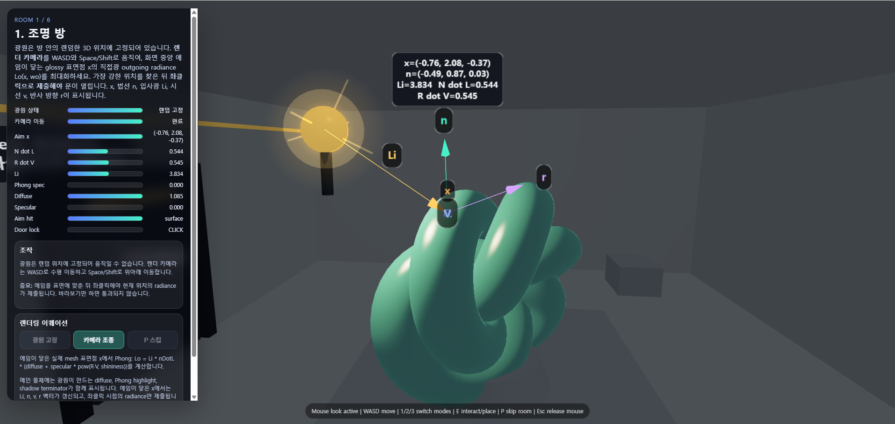

디버그 화면에서는 표면점 `x`, 법선 `n`, 입사광 방향 `Li`, 시선 방향 `v`, 반사 방향 `r`을 함께 표시했습니다. 이 장면은 조명 계산이 단순히 색을 입히는 과정이 아니라, 표면 방향과 광원 위치, 카메라 위치의 관계로 결정된다는 점을 보여줍니다.

조명 계산은 diffuse와 specular 항으로 나누어 처리했습니다.

```text
Diffuse = kd * Li * max(N dot L, 0)
Specular = ks * Li * max(R dot V, 0)^shininess
Lo = Diffuse + Specular
```

diffuse는 표면 법선 `N`과 광원 방향 `L`이 가까울수록 커집니다. 반면 specular는 반사 방향 `R`과 시선 방향 `V`가 비슷할 때 강하게 나타납니다. 게임에서는 이 계산을 `ShaderMaterial`과 JavaScript 점수 계산 양쪽에 사용했습니다. 물체 표면에는 diffuse, specular, shadow terminator가 보이도록 shader를 적용했고, 플레이어가 선택한 표면점은 `Raycaster`로 구했습니다. `Raycaster`는 화면 중앙에서 월드 공간으로 ray를 쏘고, 그 ray가 실제 물체 mesh와 만나는 지점을 찾아냅니다.

좌표 변환도 이 단계에서 중요하게 사용됩니다. 물체의 vertex는 object space에 있지만, 조명 계산에 쓰이는 표면점과 법선은 world space 기준으로 맞춰야 합니다. 따라서 normal matrix를 사용해 표면 법선을 월드 공간 법선으로 변환했습니다. 플레이어가 움직이는 카메라 위치도 world space의 점이며, `x`에서 카메라를 향하는 방향이 시선 벡터 `v`가 됩니다.

정리하면 조명 방은 “빛이 표면에 닿은 뒤 법선, 광원 방향, 시선 방향에 따라 최종 radiance가 달라진다”는 내용을 플레이어가 직접 찾도록 만든 단계입니다.

## 2. Shading Room

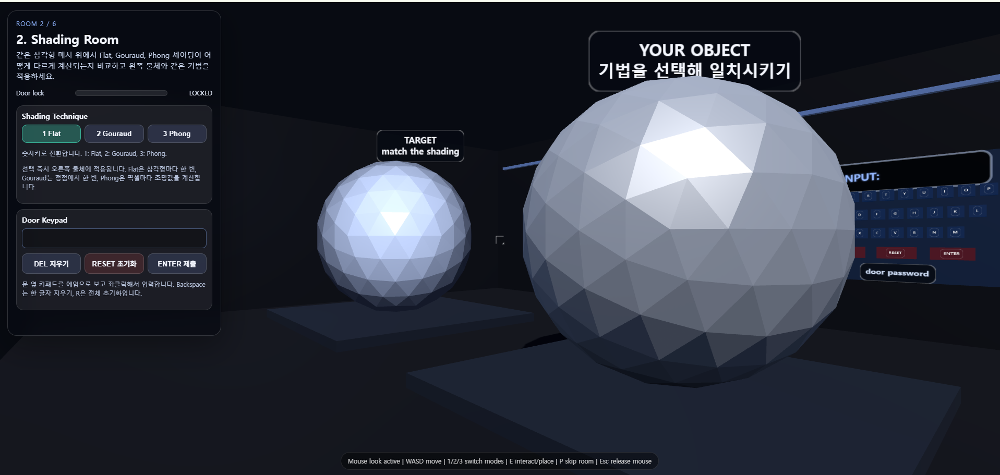

두 번째 단계는 셰이딩 방식의 차이를 구분하는 Shading Room입니다. 왼쪽에는 목표 물체가 있고, 오른쪽에는 플레이어가 조절하는 물체가 있습니다. 두 물체는 같은 삼각형 mesh를 사용하지만, 셰이딩 방식이 다르게 적용됩니다. 플레이어는 `1`, `2`, `3` 키나 왼쪽 UI 버튼을 사용해 Flat, Gouraud, Phong 셰이딩을 바꿀 수 있습니다.

목표는 왼쪽 물체와 같은 셰이딩 방식을 오른쪽 물체에 적용하는 것입니다. 목표 물체에는 Phong shading이 적용되어 있으므로, 플레이어도 오른쪽 물체를 Phong으로 맞춰야 합니다. 다만 탈출은 셰이딩을 맞추는 것만으로 끝나지 않도록 구성했습니다. 문 옆에 있는 3D 키패드에 정답 `PHONG`을 입력하고 제출해야 다음 방으로 이동할 수 있습니다.

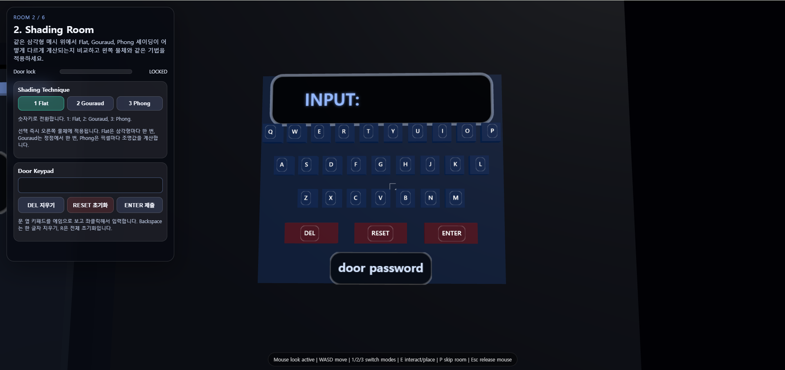

위 화면은 문 옆에 배치한 3D 키패드입니다. 키패드는 HTML 입력창이 아니라 게임 월드 안의 3D 오브젝트로 만들었습니다. 알파벳 키, `DEL`, `RESET`, `ENTER`는 모두 plane과 box mesh로 구성되어 있습니다. 플레이어가 마우스나 에임으로 키를 누르면 `Raycaster`가 어떤 키를 선택했는지 판정합니다.

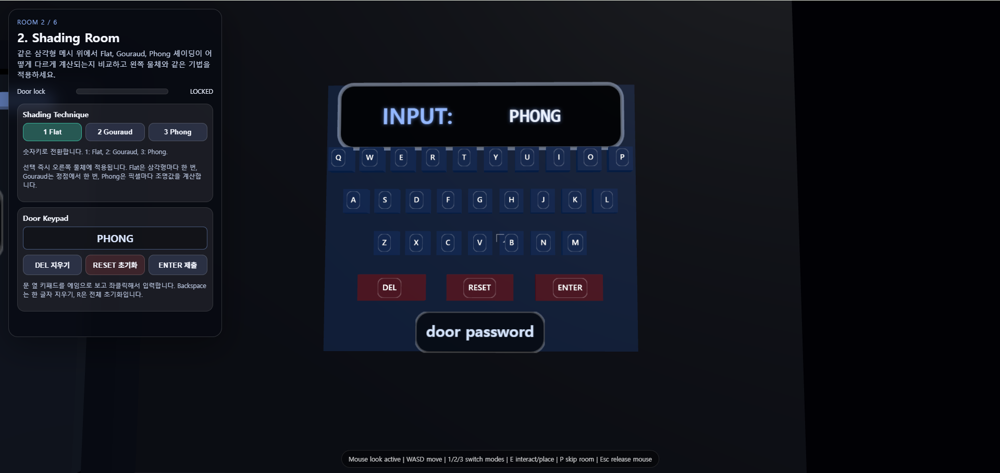

`PHONG`을 입력한 뒤 `ENTER`를 누르면 문이 열립니다. 이 입력 방식은 셰이딩 개념과 퍼즐 진행이 분리되지 않도록 하기 위한 장치입니다. 플레이어는 화면에서 Phong shading의 특징을 확인하고, 그 이름을 직접 입력해야 다음 단계로 넘어갑니다.

이 단계의 핵심은 Flat, Gouraud, Phong 셰이딩의 계산 위치 차이를 보여주는 것입니다. Flat shading은 face마다 하나의 법선으로 조명을 계산하기 때문에 삼각형 면이 또렷하게 드러납니다. Gouraud shading은 vertex shader에서 정점마다 조명을 계산하고, 그 값을 rasterization 과정에서 픽셀 사이에 보간합니다. 전체적으로 부드럽게 보이지만, 작은 하이라이트가 정점 사이에서 사라질 수 있습니다. Phong shading은 fragment shader에서 픽셀마다 보간된 법선을 다시 normalize하고 조명을 계산합니다. 그래서 하이라이트가 가장 자연스럽게 이어집니다.

`L3.rasterization_2`에서 다룬 보간 개념도 이 단계에 포함됩니다. Gouraud는 색이나 밝기 자체가 보간되는 방식이고, Phong은 법선이 보간된 뒤 픽셀마다 다시 조명 계산을 하는 방식입니다. 같은 삼각형 mesh라도 계산 위치가 face, vertex, fragment 중 어디인지에 따라 결과가 완전히 달라지는 것을 게임 화면에서 확인할 수 있습니다.

구현 측면에서는 `MeshPhongMaterial`의 `flatShading` 옵션으로 Flat shading을 만들고, Gouraud와 Phong은 `ShaderMaterial`로 직접 구현했습니다. 키패드와 라벨은 `CanvasTexture`로 만든 텍스트를 3D plane에 붙이는 방식으로 구성했습니다. 또한 depth test를 적용해 키패드가 물체 뒤에서 비정상적으로 뚫려 보이지 않도록 처리했습니다.

## 3. 텍스처 방

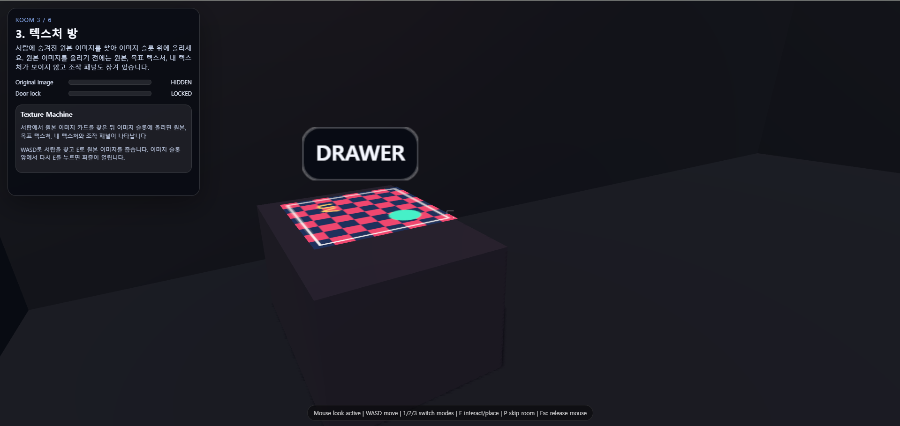

세 번째 단계는 텍스처 좌표와 wrapping 방식을 다루는 텍스처 방입니다. 처음 방에 들어오면 텍스처 퍼즐이 바로 보이지 않습니다. 플레이어는 먼저 서랍 위에 숨겨진 original image 카드를 찾아야 합니다. 이 장면은 텍스처가 단순한 장식 요소가 아니라 퍼즐을 풀기 위한 핵심 입력으로 사용된다는 점을 보여줍니다.

탈출 흐름은 세 단계로 구성했습니다. 먼저 서랍에서 original image 카드를 찾습니다. 다음으로 image slot 위에 카드를 올립니다. 마지막으로 target texture와 your texture를 비교하면서 wrapping, repeat, offset 값을 조절해 두 텍스처를 거의 같게 맞춥니다.

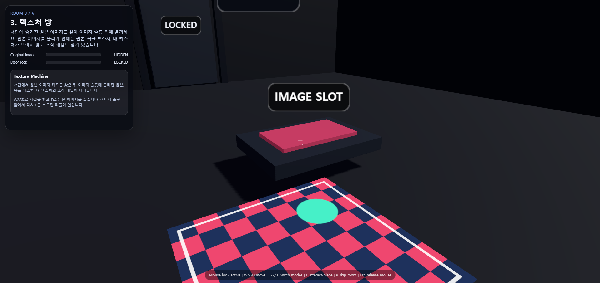

image slot은 텍스처 기계를 여는 장치입니다. original image를 올리기 전에는 목표 텍스처와 플레이어 텍스처가 보이지 않고, 조작 패널도 잠겨 있습니다. 이 구조를 넣은 이유는 texture mapping이 이미지와 UV 좌표의 대응에서 시작된다는 점을 게임 진행 안에 넣기 위해서입니다.

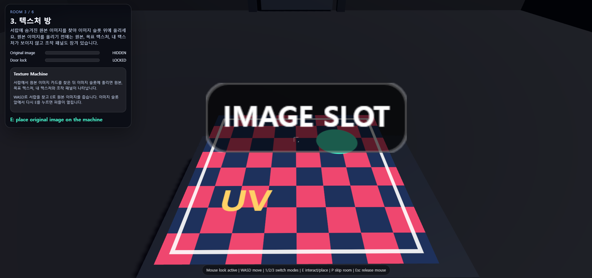

original image를 슬롯에 올리면 original, target texture, your texture가 나타납니다. 이 시점부터 플레이어는 texture wrapping과 UV transform을 조절할 수 있습니다.

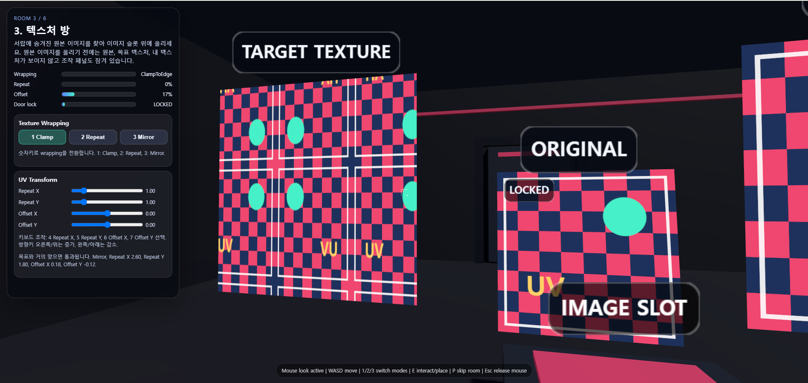

위 화면에서 왼쪽은 target texture입니다. 원본 체크 패턴이 반복되고, 위치가 밀려 있으며, 일부는 거울처럼 반전되어 있습니다. 이 단계에서는 `wrapS`, `wrapT`, `repeat`, `offset` 개념을 퍼즐 규칙으로 사용했습니다.

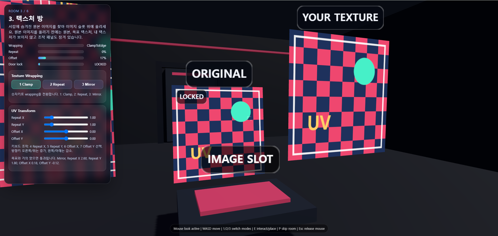

오른쪽은 플레이어가 조절하는 your texture입니다. 처음에는 target과 다르게 보입니다. 플레이어는 `1 Clamp`, `2 Repeat`, `3 Mirror`로 wrapping 방식을 바꾸고, `Repeat X`, `Repeat Y`, `Offset X`, `Offset Y` 값을 조절합니다.

텍스처 좌표 `u, v`는 이미지의 어느 위치를 읽을지 결정하는 좌표입니다. `repeat`는 같은 이미지가 몇 번 반복될지를 정하고, `offset`은 UV 시작점을 이동시킵니다. `ClampToEdgeWrapping`은 가장자리 픽셀을 늘려 고정하고, `RepeatWrapping`은 이미지를 반복하며, `MirroredRepeatWrapping`은 반복될 때마다 좌우나 상하가 반전되도록 만듭니다.

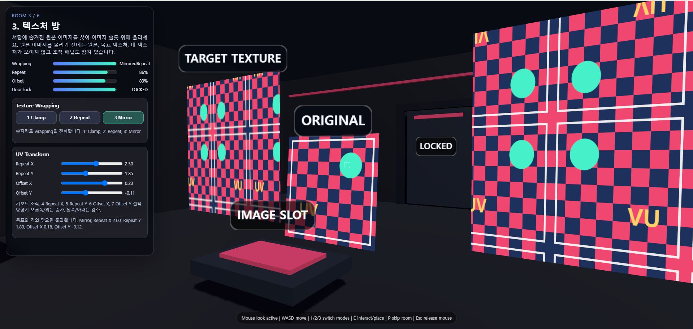

정답에 가까운 값은 `MirroredRepeatWrapping`, `Repeat X = 2.60`, `Repeat Y = 1.80`, `Offset X = 0.18`, `Offset Y = -0.12`입니다. 게임 내부에서는 wrapping 점수, repeat 점수, offset 점수를 가중합으로 계산했습니다.

```text
total = wrapScore * 0.42 + repeatScore * 0.34 + offsetScore * 0.24
```

점수가 기준 이상이면 문이 열립니다. 플레이어가 슬라이더를 움직일 때마다 texture coordinate가 바뀌고, 그 결과가 3D plane 위에서 바로 보이도록 구현했습니다. 이를 통해 texture sampling, wrapping mode, UV transform의 차이를 눈으로 비교하면서 확인할 수 있습니다.

## 4. Animation Room

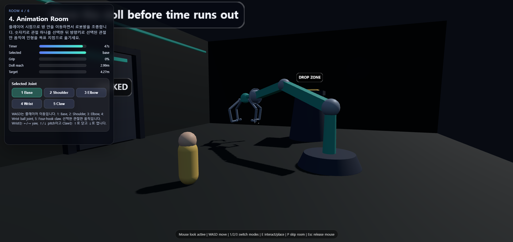

네 번째 단계는 계층 애니메이션과 forward kinematics를 이용한 Animation Room입니다. 이 방에서는 플레이어가 로봇팔을 조종해서 인형을 목표 지점으로 옮겨야 합니다. 제한 시간이 있으며, 시간이 끝나면 로봇팔과 인형이 초기화됩니다.

로봇팔은 base, shoulder, elbow, wrist, claw로 구성되어 있습니다. 숫자키 `1`부터 `5`까지로 조종할 관절을 선택하고, 방향키로 선택한 관절만 움직입니다. WASD는 플레이어 이동에 사용하고, 방향키는 로봇팔 관절 제어에 사용했습니다.

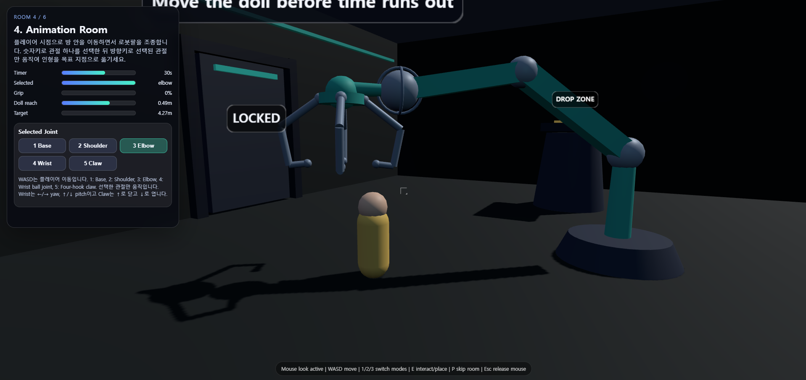

이 단계에서는 joint hierarchy와 forward kinematics를 로봇팔 조작으로 바꾸었습니다. 로봇팔은 `THREE.Group` 계층으로 만들었습니다. base가 회전하면 그 아래의 shoulder, elbow, wrist, claw가 함께 움직입니다. shoulder가 움직이면 elbow, wrist, claw가 같이 따라 움직입니다. 이 구조는 부모-자식 local transform이 누적되어 world transform을 만드는 방식과 연결됩니다.

forward kinematics는 다음과 같은 구조로 이해할 수 있습니다.

```text
child world position = parent transform들이 누적된 결과
```

게임에서는 각 joint의 local rotation을 바꾸고, Three.js의 scene graph가 그 회전을 자식 관절에 전파하도록 했습니다. 집게의 실제 월드 위치는 `localToWorld`로 계산했습니다. local space에 있는 집게 grip 위치를 world space로 변환해야 인형과의 거리를 정확히 잴 수 있기 때문입니다.

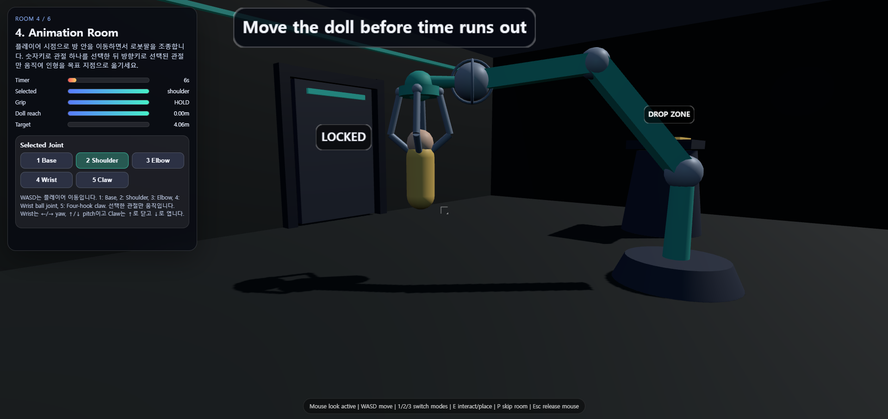

위 화면은 집게가 인형을 잡은 상태입니다. 인형의 grip 지점이 집게 안에 들어오고, 집게가 충분히 닫히면 `HOLD` 상태가 됩니다. `HOLD` 상태에서는 인형이 집게의 grip 위치를 따라갑니다. 이 과정은 단순히 mesh를 붙이는 방식이 아니라, 집게의 월드 좌표를 매 프레임 계산해서 인형 위치를 갱신하는 방식으로 구현했습니다.

충돌은 완전한 물리 엔진을 사용하지 않고 직접 근사했습니다. 로봇팔 segment는 선분으로 보고, 인형은 세로 캡슐 형태로 보며, 목표 지점은 원기둥으로 처리했습니다. 이 근사를 통해 로봇팔이 인형이나 드롭존을 뚫지 않도록 막을 수 있었습니다.

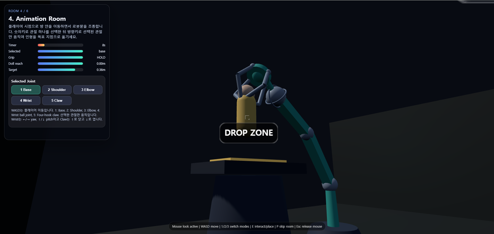

탈출 조건은 인형을 집어서 오른쪽 drop zone 위에 올리는 것입니다. 인형이 drop zone 상단에 놓이면 성공으로 처리됩니다. 또한 공중에서 인형을 놓았을 때 인형의 이동 경로가 drop zone 상단을 통과해도 성공으로 판정했습니다. 그래서 실제 플레이에서는 목표 지점 바로 위에서 집게를 열어도 탈출할 수 있습니다.

이 방에는 local/world transform, Euler angle과 orientation, joint hierarchy, forward kinematics가 함께 들어갑니다. 강의에서 다룬 관절 구조가 로봇팔 조작이라는 상호작용으로 이어지도록 구성한 단계입니다.

## 5. DDGI Hide and Seek

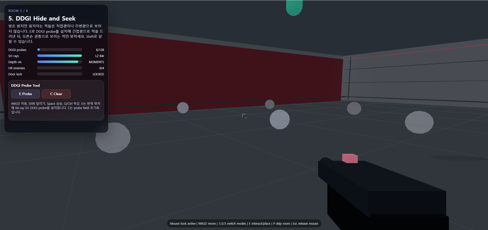

다섯 번째 단계는 DDGI Hide and Seek입니다. 이 방은 채점 기준에서 GI 기술 적용에 해당하는 핵심 단계입니다. 방 자체는 밝아 보이지만, 움직이는 적들은 direct light나 ambient light만으로는 보이지 않도록 만들었습니다. 플레이어는 3차원 공간을 날아다니며 DDGI probe를 설치해야 합니다.

조작은 `E`로 probe 설치, `C`로 probe 초기화, 좌클릭으로 사격입니다. Shift로 달리고, Space로 상승하며, Q 또는 Ctrl로 하강할 수 있습니다. 적은 GI로 충분히 드러난 순간에만 맞힐 수 있습니다.

이 단계에서는 direct lighting과 indirect lighting의 차이를 게임 규칙으로 사용했습니다. direct lighting은 광원에서 표면으로 바로 오는 빛이고, indirect lighting은 다른 표면에 반사된 뒤 도달하는 빛입니다. 이 방의 적은 direct light만으로는 보이지 않고, probe가 저장한 indirect irradiance가 충분히 쌓여야 opacity가 올라갑니다.

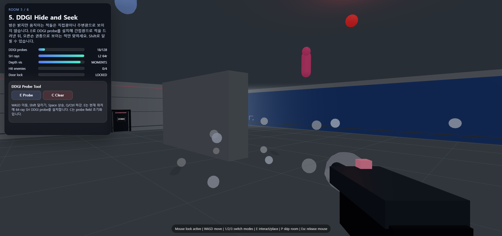

위 화면처럼 probe를 충분히 설치하면 숨은 적이 서서히 드러납니다. 흰색 구들은 설치된 DDGI probe입니다. probe는 공간 안에 놓인 간접광 저장점이며, 주변 방향으로 ray를 쏜 뒤 ray가 표면에 맞으면 그 표면에서 얻은 radiance를 저장합니다.

게임 안의 DDGI probe는 다음 데이터를 가집니다.

```text
probe position
64개 golden sphere ray 방향
ray hit depth
ray depth moment
L2 spherical harmonics 9 coefficients
probe irradiance
```

각 probe는 64개의 방향으로 ray를 쏘고, hit 지점의 one-bounce radiance를 계산한 뒤 SH coefficient에 누적합니다. 적 위치에서는 주변 probe들의 SH 값을 거리 가중치와 visibility로 섞어 indirect light 값을 얻습니다. 이 값이 높아질수록 적의 opacity가 증가하고, 일정 수준 이상 드러난 적만 사격으로 맞힐 수 있습니다.

특히 depth moment visibility를 넣은 점이 중요합니다. DDGI는 probe가 벽 뒤까지 빛을 새게 만드는 light leaking 문제가 생길 수 있습니다. 이 게임에서는 ray depth와 depth squared를 저장하고, 적 위치가 probe가 본 표면보다 뒤에 있는지 검사해 누수를 줄였습니다.

탈출 조건은 적을 모두 맞히는 것입니다. 하지만 적을 맞히려면 먼저 probe field가 만들어져야 합니다. 따라서 플레이어는 무작정 총을 쏘는 것이 아니라, 공간을 읽고 probe를 배치해야 합니다. 이 과정에서 “GI는 빛 정보를 저장하고 재사용한다”는 핵심 개념이 게임 규칙으로 바뀝니다.

## 6. Surfel GI Hide and Seek

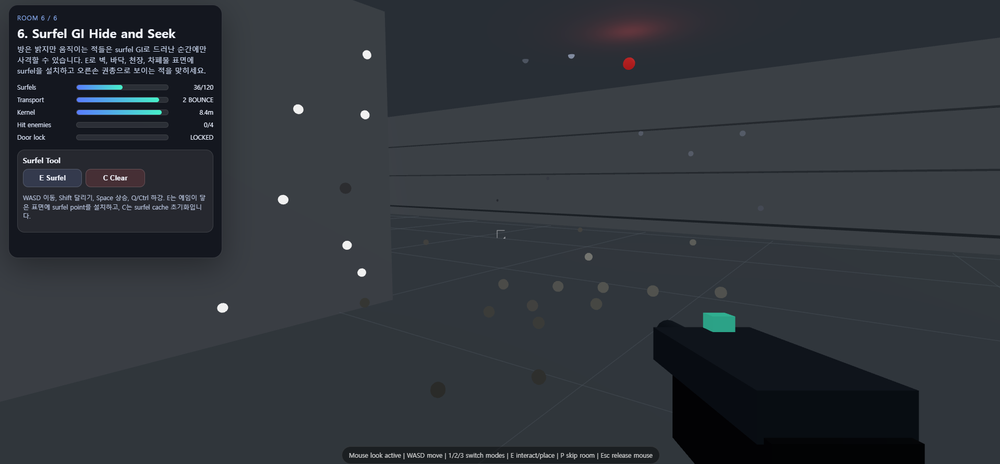

여섯 번째 단계는 Surfel GI Hide and Seek입니다. 이 방도 GI 기술 적용에 해당하지만, DDGI 방과는 다른 방식으로 간접광을 저장합니다. DDGI가 공간에 probe를 설치하는 방식이라면, Surfel GI는 표면에 surfel을 설치하는 방식입니다. 즉 DDGI는 빈 공간에도 lighting cache를 둘 수 있고, Surfel GI는 벽, 바닥, 천장, 차폐물 같은 실제 표면 위에 간접광 저장점을 붙입니다.

조작 방식은 DDGI 방과 비슷합니다. `E`를 누르면 에임이 닿은 표면에 surfel이 설치되고, `C`로 초기화할 수 있습니다. 좌클릭은 사격입니다. 적은 Surfel GI로 충분히 드러난 순간에만 맞힐 수 있습니다.

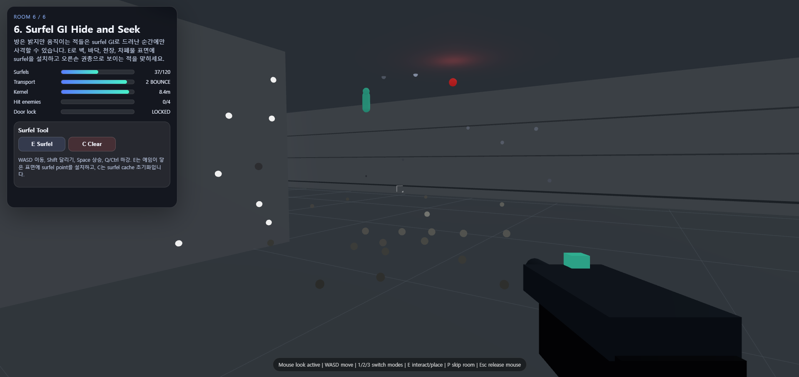

위 화면의 작은 점들이 surfel입니다. 밝은 점은 강한 radiance를 가진 surfel이고, 어두운 점은 상대적으로 약한 surfel입니다. 왼쪽 차폐물, 바닥, 벽에 surfel이 붙어 있으며, 적의 visibility는 이 surfel field를 샘플한 값으로 결정됩니다.

surfel은 surface element를 의미합니다. 이 게임에서는 surfel을 표면에 붙은 lighting cache sample로 사용했습니다. 각 surfel은 다음 정보를 저장합니다.

```text
pos: 표면 위치
normal: 표면 법선
irradiance: 저장된 간접광 세기
direct: 직접광으로 받은 radiance
color: 표면 색
area: 대표 면적
radius: transport kernel 반경
```

적 위치에서 surfel field를 샘플할 때는 거리, surfel normal, receiver 방향, solid angle, kernel falloff, 차폐 여부를 함께 계산했습니다. surfel에서 적을 향하는 방향이 surfel normal과 잘 맞을수록 contribution이 커지고, 거리가 멀수록 약해집니다. 중앙 차폐물에 막히면 contribution이 사라지도록 처리했습니다.

또한 surfel을 설치한 뒤 전체 surfel cache를 두 번 relight하도록 구성했습니다. 이 과정에서는 새 surfel의 direct radiance만 사용하는 것이 아니라, 기존 surfel들이 가진 bounce 값도 다시 섞습니다. 따라서 surfel은 단순한 점 장식이 아니라, 표면에 붙은 간접광 cache로서 서로 영향을 주는 구조를 가집니다.

DDGI와 Surfel GI의 차이는 플레이 방식에서도 드러납니다. DDGI는 공간에 probe를 놓기 때문에 큰 방을 3D grid처럼 덮는 느낌에 가깝습니다. 반면 Surfel GI는 표면에 점을 찍어 빛을 저장하므로, 벽과 바닥의 표면 정보를 더 직접적으로 활용합니다.

탈출 조건은 DDGI 방과 마찬가지로 적을 모두 맞히는 것입니다. 다만 DDGI 방에서는 “어느 공간을 덮을 것인가”가 중요했다면, Surfel GI 방에서는 “어느 표면에 cache를 붙일 것인가”가 더 중요합니다. 이 차이를 통해 DDGI와 Surfel GI의 구조적 차이가 게임 플레이 안에서도 드러나도록 만들었습니다.

